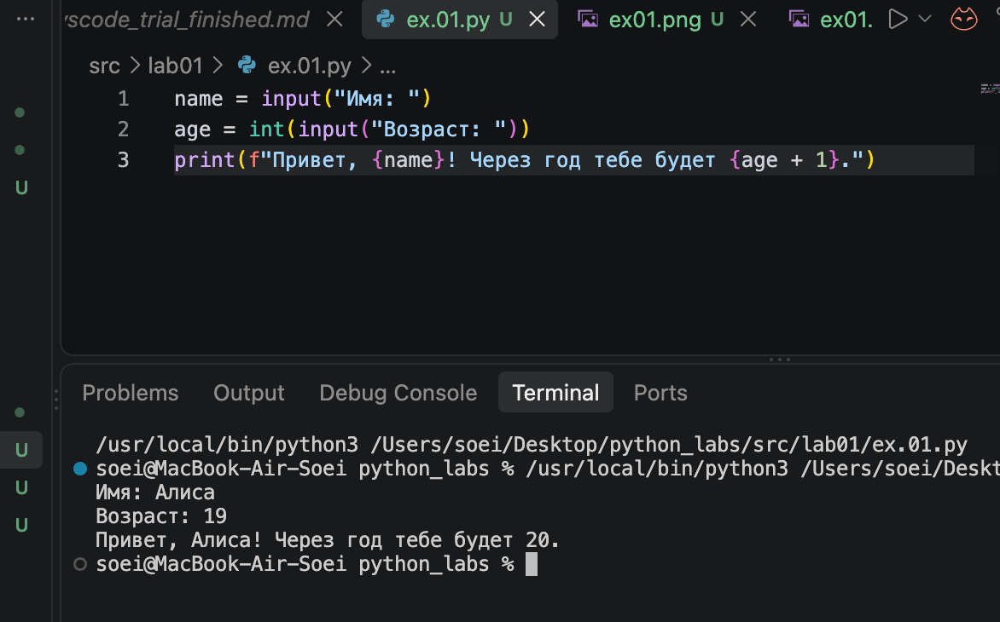
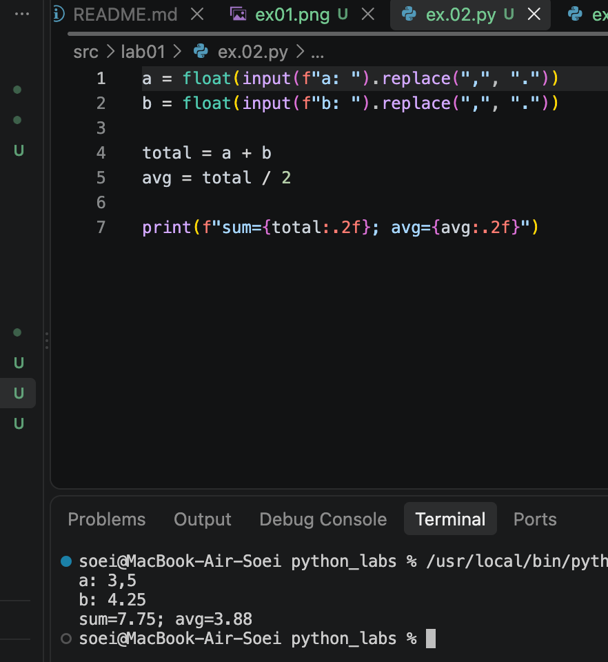
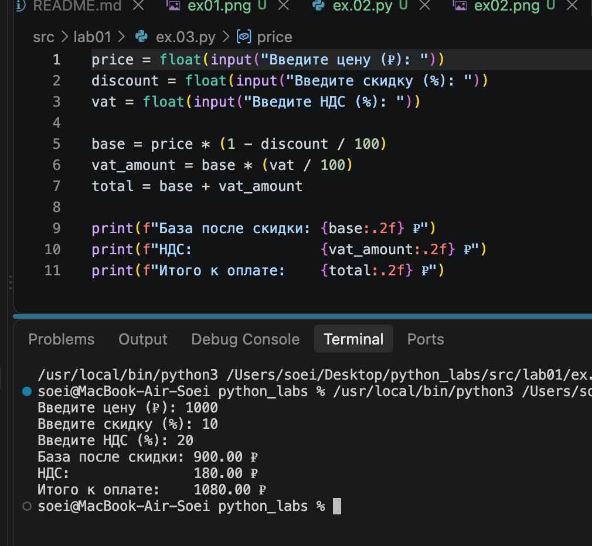
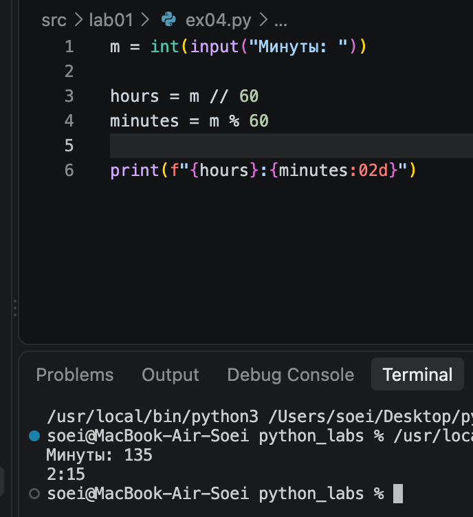
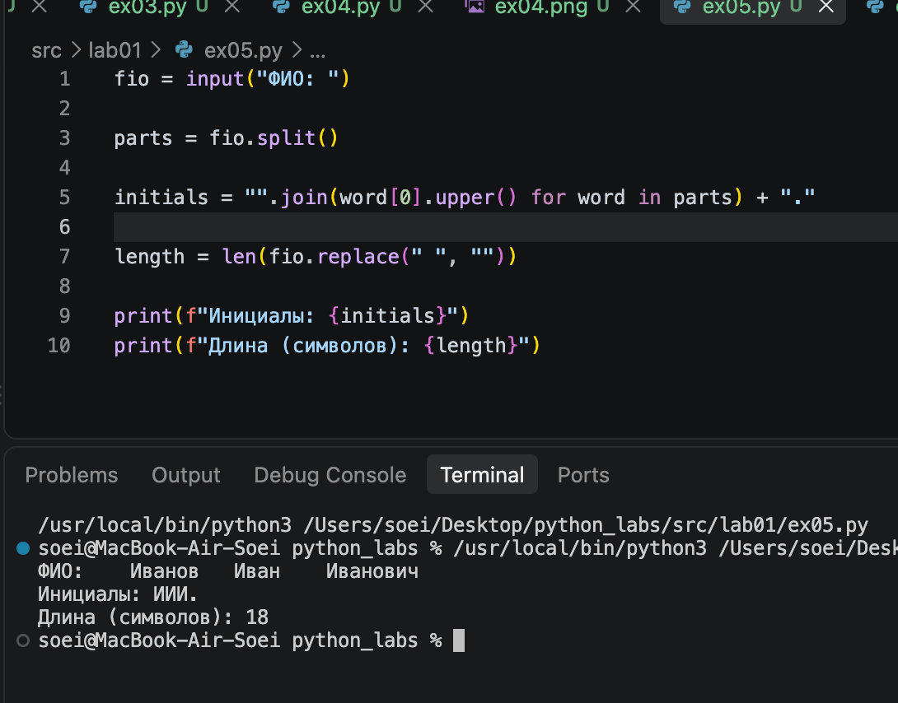
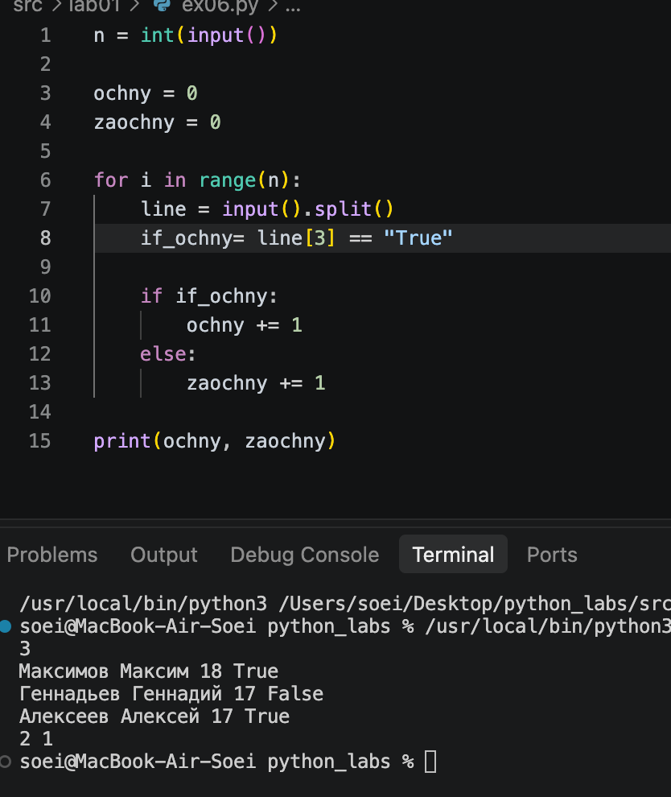

# python_labs
# Лабораторная работа 1
# Задание 1

## Запрашиваем у пользователя имя (как строку) и возраст. Возраст сразу конвертируем в целое число с помощью int(). Производим математическое действие: прибавляем к текущему возрасту один год. Для вывода используем f-строку, чтобы красиво подставить имя и будущий возраст.

# Задание 2

## Принимаем два числа. Важный момент: с помощью метода replace() меняем запятые на точки, чтобы корректно перевести строки в числа с плавающей точкой (float). Считаем сумму и среднее арифметическое. При выводе через f-строку используем форматирование :.2f, которое автоматически оставляет только два знака после запятой.

# Задание 3

## Считываем три вещественных числа: цену, скидку и НДС. Проводим вычисления по формулам: сначала находим цену со скидкой, затем вычисляем сумму НДС от этой цены, и в конце прибавляем НДС к базовой стоимости. Выводим все три результата, применяя форматирование до двух знаков после запятой.

# Задание 4

## Получаем количество минут и переводим его в целое число. Чтобы узнать часы, используем оператор целочисленного деления //. Чтобы найти оставшиеся минуты, применяем оператор остатка от деления %. При печати результата используем формат :02d для минут, чтобы однозначные числа отображались с ведущим нулем (например, 05).

# Задание 5

## Считываем ФИО. Разбиваем строку на отдельные слова с помощью split(). С помощью генератора списка проходимся по всем словам, берем их первые буквы ([0]), делаем их заглавными (upper()) и объединяем в одну строку без пробелов, добавляя точку в конце. Также считаем длину строки, предварительно удалив из нее все пробелы.

# Задание 6

## Считываем количество учеников. Заводим две переменные-счетчика для очников и заочников. Запускаем цикл for на нужное количество итераций. Внутри цикла считываем строку с данными, разбиваем ее по пробелам и проверяем последний элемент (индекс 3). Если он равен "True", увеличиваем счетчик очников, иначе — заочников. В конце выводим оба счетчика.
