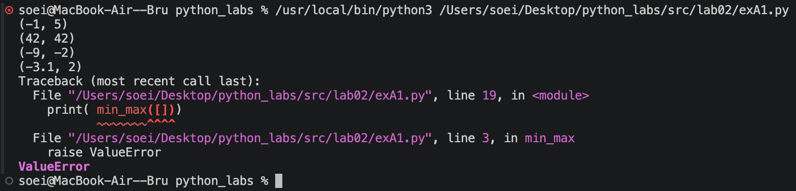
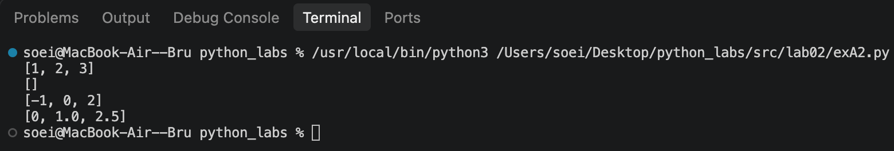
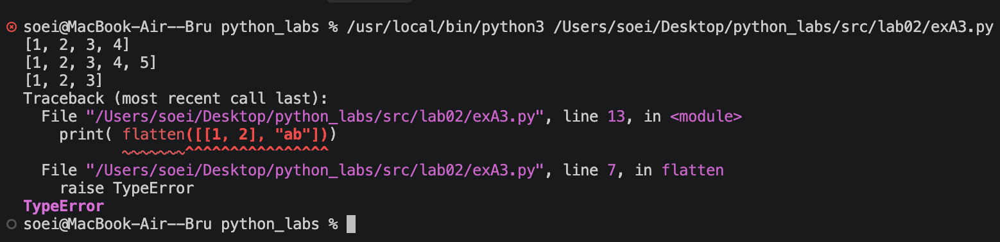
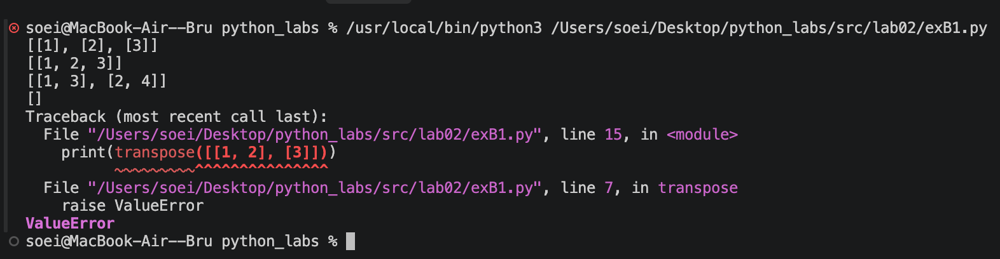
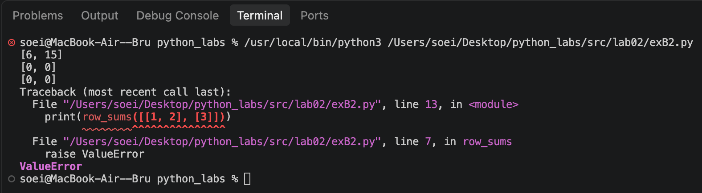
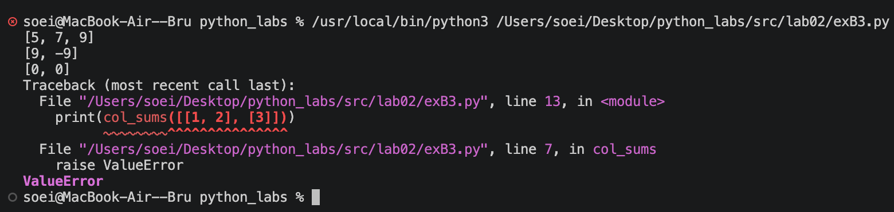

# python_labs
# Лабораторная работа 2

# Задание A1
## Реализуем функцию поиска минимума и максимума в списке. Сначала проверяем список на пустоту (вызываем ошибку ValueError, если он пуст). Инициализируем минимальное и максимальное значения первым элементом списка. Затем в цикле перебираем оставшиеся числа: если число меньше текущего минимума — обновляем минимум, если больше максимума — обновляем максимум. Возвращаем кортеж из двух значений.

```python 

def min_max(nums: list[float | int]) -> tuple[float | int, float | int]:
    if not nums:
        raise ValueError
    
    min_val = max_val = nums[0]

    for num in nums[1:]:
        if num < min_val:
            min_val = num
        if num > max_val:
            max_val = num

    return min_val, max_val
```


# Задание А2
## Создаем пустой список для уникальных чисел. Проходимся циклом по входным значениям: если числа еще нет в этом списке — добавляем его. Так получаем список без повторов. Записываем его длину в переменную n. Далее запускаем двойной цикл, где i — номер прохода, а j — индекс текущей пары. Если текущий элемент больше следующего — меняем их местами через кортежное присваивание. С каждым проходом внутренний цикл укорачивается на один элемент (n - i - 1), так как правый край уже отсортирован. В итоге возвращаем отсортированный список уникальных значений.

``` python
def unique_sorted(nums: list[float | int]) -> list[float | int]:

    uni_nums = []
    for num in nums:
        if num not in uni_nums:
            uni_nums.append(num)
    n = len(uni_nums)
    for i in range(n):
        for j in range(n-i-1):
            if uni_nums[j]>uni_nums[j+1]:
                uni_nums[j],uni_nums[j+1]=uni_nums[j+1],uni_nums[j]
    return uni_nums

```


# Задание А3
## Пишем функцию flatten, которая «расплющивает» список списков и кортежей в один плоский список. Создаем пустой массив res для результата. Далее циклом for перебираем каждое значение входного списка. На каждой итерации проверяем через type(): если текущий элемент является списком (list) или кортежем (tuple), добавляем все его элементы в результирующий список методом extend — он распаковывает строку и добавляет элементы по одному, а не целиком. В противном случае выбрасываем TypeError, так как элемент не является допустимым типом строки матрицы. Если ошибок не возникло, возвращаем заполненный плоский список.

``` python
def flatten(mat: list[list | tuple])-> list:
    res = []
    for i in mat:
        if type(i) == list or type(i) == tuple:
            res.extend(i)
        else:
            raise TypeError
    return res
```


# Задание B1
## Пишем функцию транспонирования матрицы. Если матрица пустая, возвращаем пустую матрицу. В переменную записываем длину первой строки матрицы. С помощью цикла перебираем все строки матрицы. Если длина какой-либо строки не совпадает с длиной первой строки, выводим ошибку(значит матрица рваная). В выводе звездочка(*) распаковывает список, то есть берет первые элементы, вторые и так далее. По сути, группирует элементы по столбцам. zip возвращает кортежи, а нам нужны списки. Поэтому мы превращаем список в кортеж. 

``` python
def transpose(mat: list[list[float | int]]) -> list[list]:
    if not mat:
        return []
    row_len = len(mat[0])
    for row in mat:
        if len(row) != row_len:
            raise ValueError
    return [list(row) for row in zip(*mat)]
```


# Задание B2
## Пишем функцию row_sums для подсчёта суммы элементов каждой строки матрицы. Если матрица пустая, возвращаем пустой список. В переменную row_len записываем длину первой строки. С помощью цикла перебираем все строки и проверяем, что их длина совпадает с длиной первой строки, иначе вызывается ValueError (матрица «рваная»). Для подсчёта сумм используем списковое включение [sum(row) for row in mat], где встроенная функция sum() складывает элементы каждой строки, а результат собирается в новый список.

``` python
def row_sums(mat: list[list[float | int]]) -> list[float]:
    if not mat:
        return []
    row_len = len(mat[0])
    for row in mat:
        if len(row) != row_len:
            raise ValueError
    return [sum(row) for row in mat]
```


# Задание B3
## Функция col_sums считает сумму элементов каждого столбца матрицы. Сначала проверяется, что матрица не пустая и не «рваная» (иначе ValueError). Затем с помощью zip(*mat) матрица транспонируется (столбцы становятся строками), а списковое включение [sum(row) for row in ...] считает сумму каждой полученной строки — это и есть суммы столбцов исходной матрицы.

``` python
def col_sums(mat: list[list[float | int]]) -> list[float]:
    if not mat:
        return []
    row_len = len(mat[0])
    for row in mat:
        if len(row) != row_len:
            raise ValueError
    return [sum(row) for row in zip(*mat)]
```


# Задание С
## Функция format_record принимает кортеж из трёх элементов (ФИО, группа, GPA) и возвращает отформатированную строку. Сначала распаковываем кортеж и проверяем типы данных: при неверных типах вызывается TypeError. ФИО очищается от лишних пробелов через strip().split() и разбивается на части, группа — через strip(). Затем проверяются пустые значения и диапазон GPA [0.0, 5.0] — иначе ValueError. Фамилия приводится к виду «Первая заглавная, остальные строчные» через .capitalize(). Инициалы формируются из 1–2 имён с помощью среза [1:3], первая буква каждого имени переводится в верхний регистр. GPA форматируется с двумя знаками после запятой через f-строку :.2f. Итоговая строка собирается в формате: Фамилия И.О., гр. Группа, GPA 0.00.

``` python
def format_record(rec: tuple[str, str, float]) -> str:

    fio, group, gpa = rec

    if not isinstance(fio, str) or not isinstance(group, str):
        raise TypeError("ФИО и группа должны быть строками")
    if not isinstance(gpa, (int, float)):
        raise TypeError("GPA должен быть числом")

    fio_parts = fio.strip().split()
    group = group.strip()

    if not fio_parts:
        raise ValueError("ФИО не может быть пустым")
    if not group:
        raise ValueError("Группа не может быть пустой")
    if not (0.0 <= gpa <= 5.0):
        raise ValueError("GPA должен быть в диапазоне от 0.0 до 5.0")

    surname = fio_parts[0].capitalize()

    initials = ""
    for part in fio_parts[1:3]:
        if part:
            initials += part[0].upper() + "."

    gpa_str = f"{gpa:.2f}"

    return f"{surname} {initials}, гр. {group}, GPA {gpa_str}"
```


